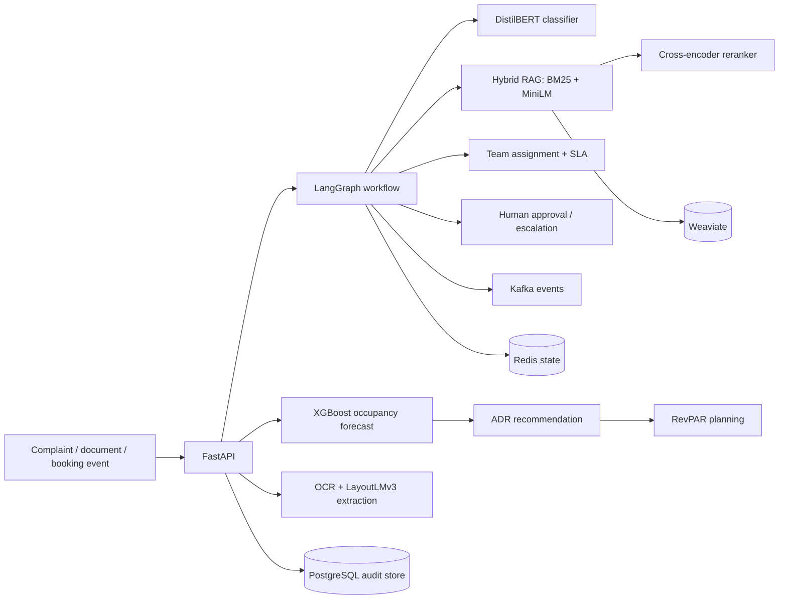

<div align="center">

# AI-Powered Hotel Operations Workflow Orchestrator

**Portfolio reconstruction by Aditya Pundhir**  
FastAPI · LangGraph · Kafka · Redis · PostgreSQL · XGBoost · DistilBERT · MiniLM · OCR · LayoutLMv3 · Hybrid RAG · Weaviate · SHAP

</div>

## Project purpose

This repository is a clean-room, portfolio-grade reconstruction of the hotel revenue-management and operations work described in Aditya Pundhir's resume. It uses only synthetic data and public/open-source libraries. It does **not** contain OYO source code, credentials, customer data, internal SOPs, or other confidential material, and it should not be presented as an official OYO repository.

The implementation covers the complete resume architecture:

- XGBoost occupancy forecasting from booking, cancellation, inventory, lead-time, pickup, calendar, and seasonality features.
- Dynamic ADR recommendations and RevPAR estimation.
- FastAPI service layer for forecasting, complaints, document extraction, RAG, and workflow execution.
- LangGraph state machine for complaint classification, SOP retrieval, team assignment, SLA tracking, escalation, and human approval.
- Kafka event publishing with an in-memory fallback for local development.
- Redis workflow-state caching with an in-memory fallback.
- PostgreSQL-ready configuration and Docker Compose service.
- Multilingual complaint-classification interface backed by DistilBERT when a fine-tuned checkpoint is available, with a deterministic lightweight fallback.
- MiniLM embeddings, BM25 retrieval, cross-encoder reranking, and an optional Weaviate backend.
- OCR and LayoutLMv3 document-extraction interfaces, with text/regex fallbacks for an immediately runnable demo.
- Evaluation and load-test scripts, including a configurable 10,000-event workflow benchmark.

## Architecture



## Resume-to-code mapping

| Resume capability | Main implementation |
|---|---|
| XGBoost occupancy forecasting | `app/ml/occupancy_forecaster.py` |
| Dynamic room-rate recommendations | `app/ml/pricing_engine.py` |
| ADR and RevPAR estimates | `app/ml/pricing_engine.py` |
| FastAPI modular application | `app/main.py`, `app/api/` |
| LangGraph state machine | `app/workflows/hotel_ops_graph.py` |
| Kafka / Redis / PostgreSQL | `app/infrastructure/`, `docker-compose.yml` |
| DistilBERT complaint classification | `app/ml/complaint_classifier.py`, `scripts/train_distilbert.py` |
| MiniLM embeddings | `app/rag/hybrid_retriever.py` |
| BM25 + vector retrieval | `app/rag/hybrid_retriever.py` |
| Cross-encoder reranking | `app/rag/hybrid_retriever.py` |
| Weaviate integration | `app/rag/weaviate_store.py` |
| OCR + LayoutLMv3 extraction | `app/ml/document_extractor.py`, `app/ml/layoutlm_adapter.py` |
| Workflow benchmark | `scripts/benchmark_workflows.py` |
| Model evaluation | `scripts/evaluate_models.py` |

## Quick start: lightweight local mode

The lightweight mode runs without Kafka, Redis, PostgreSQL, Weaviate, or downloaded transformer checkpoints. It uses XGBoost when available and safe local fallbacks for external services.

```bash
python -m venv .venv
# Windows: .venv\Scripts\activate
# Linux/macOS: source .venv/bin/activate
pip install -r requirements.txt
python scripts/generate_synthetic_data.py
python scripts/train_forecaster.py
python scripts/explain_forecast.py  # optional SHAP summary
uvicorn app.main:app --reload
```

Open:

- API docs: `http://127.0.0.1:8000/docs`
- Dashboard: `http://127.0.0.1:8000/dashboard`
- Health: `http://127.0.0.1:8000/health`

## Full AI and infrastructure mode

```bash
pip install -r requirements-full.txt
docker compose up --build
```

The full profile starts:

- FastAPI API
- PostgreSQL
- Redis
- Kafka
- Weaviate with gRPC enabled

Transformer checkpoints are intentionally downloaded at runtime rather than bundled in the ZIP. Fine-tuning entry points are provided in `scripts/train_distilbert.py` and `scripts/train_layoutlmv3.py`. This keeps the repository distributable and avoids embedding third-party model weights.

## Main API examples

### Run a hotel complaint through the complete workflow

```bash
curl -X POST http://127.0.0.1:8000/api/v1/workflows/complaints \
  -H "Content-Type: application/json" \
  -d '{
    "complaint_id": "C-1001",
    "hotel_id": "DEL-001",
    "room_number": "408",
    "language": "en",
    "text": "There is water leaking from the bathroom ceiling and it is getting worse."
  }'
```

### Forecast occupancy and recommend ADR

```bash
curl -X POST http://127.0.0.1:8000/api/v1/revenue/forecast \
  -H "Content-Type: application/json" \
  -d '{
    "hotel_id": "DEL-001",
    "forecast_date": "2026-08-15",
    "lead_time": 14,
    "booking_pickup_7d": 31,
    "rolling_demand_14d": 0.73,
    "cancellation_rate_28d": 0.11,
    "available_inventory": 26,
    "base_adr": 3200,
    "event_intensity": 0.7
  }'
```

### Search hotel SOPs

```bash
curl -X POST http://127.0.0.1:8000/api/v1/rag/search \
  -H "Content-Type: application/json" \
  -d '{"query":"urgent bathroom water leakage", "top_k":3}'
```

## Data and benchmark integrity

All included CSV files are synthetic. The numeric outcomes in a resume must be backed by the actual experiment logs used to produce them. Run the included scripts and report the generated measurements rather than copying target values blindly.

```bash
python scripts/evaluate_models.py
python scripts/benchmark_workflows.py --events 10000 --concurrency 50
```

The benchmark writes timestamped JSON results under `artifacts/benchmarks/`.

## Tests

```bash
pytest -q
```

## Author

**Aditya Pundhir**  
Delhi Technological University  
GitHub: `Adityapundhir10`  
LinkedIn: `adityapundhir`

## Attribution and licence

This project was rebuilt from an uploaded MIT-licensed hotel-automation starter. The original copyright notice is retained in `LICENSE`, and modification details are recorded in `NOTICE`. Third-party model weights and datasets are governed by their own licences.
